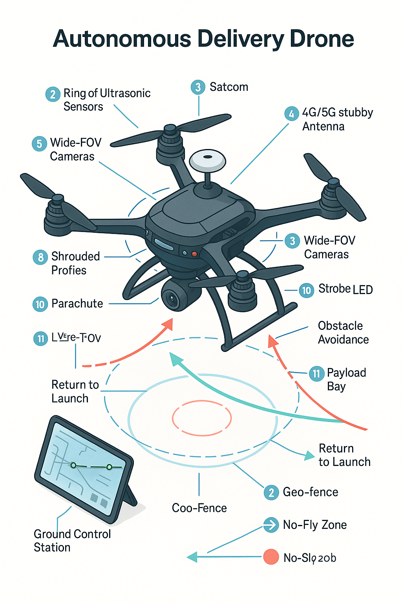

# Autonomous Delivery Drone (Proposal)

**Module:** Professional Practice Interactive Project  
**Tags:** UAV, autonomy, sensing, comms, safety

## Vision
A **last-mile delivery** UAV capable of autonomous outdoor navigation, safe package drop-off, and reliable comms, reducing delivery time and reaching hard-to-access areas. :contentReference[oaicite:8]{index=8}

## Proposed System

*Concept illustration of the proposed UAV with sensors, comms, and safety systems.*
- **Airframe & Propulsion:** Lightweight quad with efficient props for endurance.
- **Flight Control:** Pixhawk/DJI-class controller; real-time sensor fusion.
- **Navigation:** **GPS/DGPS**, waypoint mission planning, geo-fencing.
- **Perception:** **LiDAR/ultrasonic** + wide-FOV cameras for **obstacle detection/avoidance**.
- **Comms:** **4G/5G or satellite link** for telemetry & command; fallback RF.
- **Payload:** Secure bay with **positive-release** mechanism.
- **Safety:** Redundant power, **parachute recovery**, strobes/LEDs, collision-avoidance logic, **RTL** (Return-to-Launch).
- **Ground Control:** Mission planner UI, live status, manual override. :contentReference[oaicite:9]{index=9}

## Ethics & Environment
Safety, privacy, equity, and **noise/wildlife** considerations; **eco-routing** and lightweight materials to minimize impact. :contentReference[oaicite:10]{index=10}

## Deliverables (for this stage)
- Architecture diagram, mission profiles, risk register, component shortlist.
- (Next) Simulation/field prototyping + performance tests. :contentReference[oaicite:11]{index=11}

## Reflection
This proposal scoped a **credible MVP path** for UAV delivery. Future steps: hardware-in-loop tests, Webots/Gazebo simulation, and incremental autonomy trials. :contentReference[oaicite:12]{index=12}
